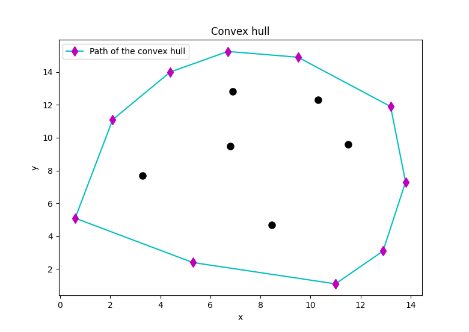

# Convex hull

## Description

An implementation of the Graham scan algorithm to find the convex hull of a finite set of points in the plane (flat, two-dimensional surface).

Basically the convex hull is a path through a sequence of points (a subset of the original points) that surrounds all points in the set of original points.

## Visualization

